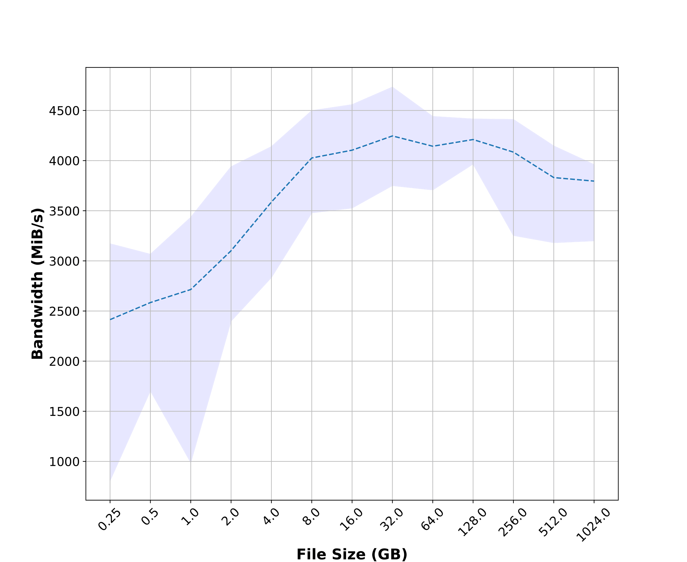
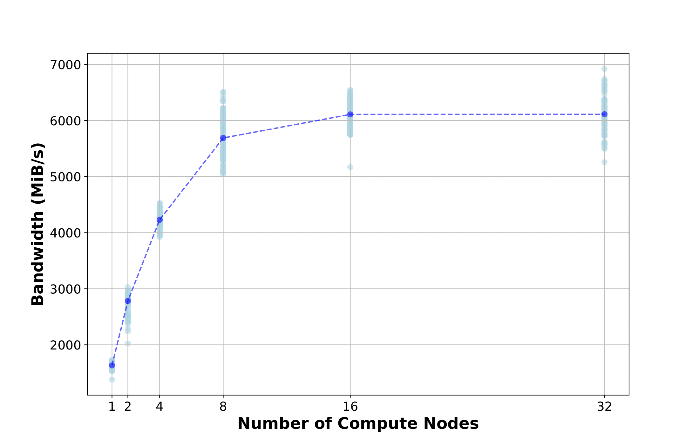
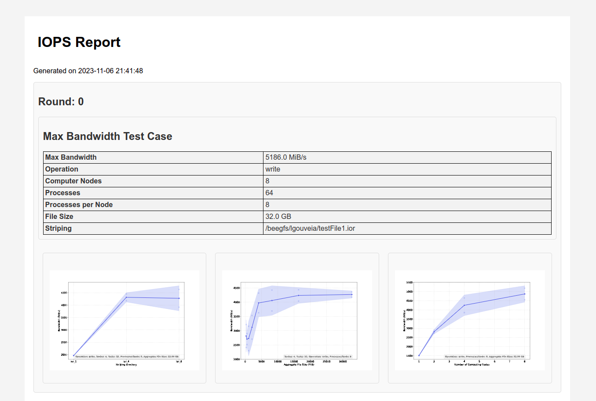

# I/O Performance Evaluation benchmark Suite (IOPS)

The I/O Performance Evaluation Suite, or IOPS, is a tool that aims to answer one and only one question: **What parameters do you need to reach the peak I/O performance of your Parallel File System (PFS)?**

The true is, IOPS is not a benchmark tool (or a suite, whatever that means we only need a word starting in S to have a nice name). IOPS utilizes open-source benchmarks, like IOR, and performs a parameter search considering the following factors:

- Number of compute nodes and processes performing I/O
- Data volume
- Access pattern
- Striping parameters

And the most important part is that it conducts this search, processes the results, generates nice graphs, and does it all automatically! No more bash scripts to perform multiple IOR experiments. No sir! Not on my watch!


## Where Do We Stand in the Sun?

You may be asking, why would I need to know this? Who cares about the parameters required to achieve maximum bandwidth for my PFS? Well, my friend, you need to know for at least three reasons:

1. To fine-tune your application and extract the maximum performance from your parallel file system.
2. To ensure that your system is delivering the expected I/O performance.
3. To identify possible bottlenecks.


The inspiration for IOPS came from this paper: [Attention, PDF!](https://inria.hal.science/hal-03753813/)

In this paper, we conducted numerous IOR executions and discovered many interesting things about our system, including incorrect configurations that were limiting the performance of our cluster (read the paper, you'll enjoy it).

But back then, we spent a lot of time writing scripts, and the automation of this process was almost non-existent. It was very error-prone, and the scripts were not portable to other machines: it was a nightmare when we tried to perform the same tests on another machine.

Moreover, it was extremely time-consuming to start the tests, wait for completion, process the data, generate the graphs, and so on. Honestly, we had a postdoc who was doing all that for us, so it wasn't really a big problem because we didn't care much about him, but now he has a permanent position, so we are forced to improve his working conditions.

## Ok! I'm Convinced. How Does It Work?

Well, we can't show you due to a minor detail that we forgot to tell you: ~~it doesn't exist yet.~~

**NOTE FROM THE FUTURE: IT DOES EXIST NOW! If you want to install and use it, go to the [Getting Started Section](#getting-started-section). We decided to keep this text because it explains important things; in the near future, it will be reformulated.**


Of course, we have the scripts from the paper, and some steps like data parsing and graph generation are already in place, but it lacks the glue that IOPS aims to be. Anyway, let me explain how it will work and the architecture behind it.

In practice, to reach the maximum I/O bandwidth of an HPC platform, you need a recipe with four main elements:

1. Sufficient volume in the I/O operation
2. Enough compute nodes (and processes per node) participating in the operation
3. A network fast enough
4. A file system that uses enough Object Storage Targets and Object Storage Servers

The equation is simple: if any of these parameters are set up in the wrong way, it will become the I/O bottleneck. Slow network? The network is the bottleneck. Too few compute nodes? The compute nodes will be the bottleneck. So, the idea is that we adjust these parameters in a way that we find the bottlenecks of the bottlenecks. 

The catch is that to evaluate each of these parameters, we first need to find the right balance. For example, to determine the right number of compute nodes, we must first establish the appropriate file size, and so on.

For instance, let's say we need to find the right number of compute nodes. Initially, we use a fixed number of nodes (say, 4) and plot the curve of file sizes to find the right data volume:



Then, after we've found the plateau, we begin running tests with a fixed file size—let's say 32GB—while varying the number of computing nodes:



At this point, we observe that the maximum bandwidth in the file size test was actually limited by the number of nodes, as we achieve significantly more bandwidth with 16 nodes. This raises the question: is 32GB the right file size when using 16 nodes? The answer is: we don't know.

Therefore, once we've determined the optimal number of nodes, we revisit the file size to see if the graph changes with the newly discovered optimal node count. This process repeats until we identify the ideal parameters.

And that's just for two parameters! We have other variables to consider, such as the number of processes, distinct striping configurations, and file patterns. So, this search for the right parameters can be very time-consuming for you—especially if you don't have a postdoc to exploit. Furthermore, we're expending energy and using resource hours that you'd generally want to conserve for others to use as well.

Consequently, IOPS can't merely be a dispatch tool. It needs to be smart, like you and me. Instead of testing all possible parameter combinations as shown in the previous graphs, IOPS will test only the strictly necessary cases. **We aim to plot a complete characterization of the file systems, showing how these parameters affect performance, while doing so both efficiently and quickly.**


## Brainstorm

This section will list a series of features, ideas, and things that we want in IOPS, so we can start thinking about its development.

### It Needs to Be Modular from Day One

Whether I want to add a new set of tests for another parameter or implement tests using another I/O benchmark, it should be easy to do.

### It Needs to Be AC-DC

- Amazingly Easy to Configure
- Definitely Easy to Commence

We should be able to go to any machine, change a couple of lines in a setup file, and deploy it immediately using the machine's job manager.

### It Will Follow Good Practices of the I/O Community

Tests need to be repeated temporally and spatially to minimize the effects of concurrent applications. In other words, we won't stop a cluster to run an IOPS analysis, so we'll need sufficient repetitions to ensure unbiased results.


### It will work in Steps: Run, then process, then decide the next Test

After running everything, IOPS will perform **Data Aggregation and Analysis**: It will generate graphs and evaluate the results, producing a report on the impact of each parameter on the system under evaluation.


---

# Getting Started Section

## Dependencies

The following packages are required to run the code:

### Core Dependencies

1. **IOR**: The I/O performance benchmark suite.
    - Source code can be found [here](https://github.com/hpc/ior)
    - Follow the installation instructions in their README or build from source.
    - Optionally, IOPS offers an `install_ior.sh` script to simplify the installation process.
    
    to install ior we need to load module mpi, gcc and cmake
    ```
    module load mpi or gcc or cmake version
    ```  
2. **libopenmpi-dev**: Open MPI development libraries.
    - **Ubuntu**: 
        ```
        sudo apt-get install libopenmpi-dev
        ```
    - **CentOS/RHEL**: 
        ```
        sudo yum install openmpi-devel        ```
    

### Optional Dependencies

1. **Conda**: For environment isolation, though not strictly necessary.
    - Download and install from [here](https://docs.conda.io/en/latest/miniconda.html)


## Installation

This section provides a step-by-step guide for installing and setting up the project. We recommend using Conda for environment isolation. If you don't have Conda installed, you can download it from [here](https://docs.conda.io/en/latest/miniconda.html).

### Steps

#### 1. Clone the Repository

First, clone the project repository to your local machine.

```bash
git clone https://gitlab.inria.fr/lgouveia/iops
```

#### 2. Create Conda Environment

To create a new Conda environment, run the following command:

```bash
conda env create -f environment.yml
```

This will create a new Conda environment and install all the dependencies listed in the `environment.yml` file.

#### 3. Activate the Environment

Activate your new Conda environment with:

```bash
conda activate your_environment_name
```

Replace `your_environment_name` with the name you've given to your Conda environment in the `environment.yml` file (by default `iops_env`).

#### 4. Install IOPS
```bash
# at iops directory
pip install .
```

#### 5. Install IOR 

If you haven't installed IOR yet, you can use the provided `install_ior.sh` script to do so. Before running the script, make sure to give it the necessary permissions:

```bash
chmod +x install_ior.sh
```

Note: Run it in the Conda environment so it will automatically update the $PATH variable.

Then, run the script:

```bash
./install_ior.sh
```


### Verifying the Installation

To ensure that everything is set up correctly, you can run IOPS with the `--check_setup` option. However, you must first generate a .ini file. IOPS provides an option to assist you with this. Begin by generating the .ini file:

```bash
iops.py --generate_ini
```

This command will create the `default_config.ini` file. You then need to update this file according to your system's specifications. After updating, you can check your configuration with the `--check_setup` option:

```bash
iops default_config.ini --check_setup
```

If everything is installed correctly, you should see the following output:

```bash
Ready to Go!
```

Remember, if you are using a cluster that utilizes modules, you need to load the MPI module, which is required by IOR.


## Running iops

If everything is okay, you can run `iops.py` with the following command:

```bash
./iops.py default_config.ini
```

Here, `default_config.ini` is the configuration file.

At the end of the execution, iops will generate an HTML report containing the details of the benchmark rounds. The HTML report is written to the work directory (defined in the .ini file) within the `report` folder. The HTML report will look like this:



# The Tools Folder

The `tools` folder contains several tools that were developed during the work reported in [Attention, PDF!](https://inria.hal.science/hal-03753813/). In essence, these are tools designed to perform some of the steps that will be carried out in `iops.py`. Others, like `hourglass.py` and `code_shooter.py`, are useful for creating experiments.

I have decided to make this repository their new home from now on.Why? Because some of them will be incorporated (or at least called) by `iops.py`. Moreover, we can now justify the use of the word "suite."

---

### `code_shooter.py`

This tool generates and writes a randomized sequence of commands in bash files. Those commands are written based on the baseline command (`base_cmd`) provided by the user. The baseline command should include a markdown (for example, `#[<name>]`) to indicate where the code should insert parameter values.

Users also need to pass a dictionary of operations (`dict_op`).

The dictionary of operations has the following structure: `{{mkd: [[op1, ...], ..., [opn, ...]]}}`, where `mkd` is the markdown at which parameters will be included. `op1` is the first operation name, and `opn` is the nth operation. Each operation is provided in a list along with its values.

Currently, the supported operations are:

- `['seq', start:int, end:int, step:int]` -> generate parameters `[start ... end]` by incrementing: `start = start + step`
- `['mul', start:int, end:int, factor:int]` -> generate parameters `[start ... end]` by multiplication: `start = start * factor`
- `['cp', value:any, N:int]` -> copy the 'value' N times.
- `['div', start:int, end:int, div:float]` -> generate parameters `[start ... end]` by division: `start = start / div`

Example of execution:

```bash
code_shooter.py "mpirun --mca mtl psm2 ior -w  -b #[0]m -o  /beegfs/testFile" --d '{{"#[0]":[["seq", 1, 10, 1]]}}' --verbose    
```

---

### `hourglass.py`

`hourglass.py` serves as a complement to `code_shooter.py`. While `code_shooter.py` is responsible for generating test commands, `hourglass.py` manages the number of repetitions of each test and introduces the concept of temporal spacing between tests. The idea is to run tests multiple times to generate statistically significant results, while avoiding executing all tests consecutively. This is essential because it's not possible to control other applications running concurrently in an HPC environment. By introducing wait times between test repetitions, the tests can cover different periods of the day.

The notion of temporal spacing originates from the I/O community, which recognizes the need to repeat tests at various times throughout the day. Otherwise, the results could be biased by background applications that might be performing I/O operations at the time of the tests.


#### Usage:

The user has several options for configuring the behavior of `hourglass.py`:

- Provide a list of commands using `--cmd_list` or specify a file containing commands separated by new lines using `--cmd_file`.
- Specify the number of repetitions using the `-r` or `--repeat` option.
- Define the start (`-s` or `--start`) and end (`-e` or `--end`) of the time range within which the wait times will be randomly selected.
- Optionally, specify the output script file name with the `-o` or `--output` option (default is `./launcher.sh`).
- Choose the unit of time for the wait intervals with `-u` or `--unit`. Acceptable units are `hr`, `min`, and `sec`.
- Enable email notifications at the end of the test using `-m` or `--mailMe` (Note: You must configure the email settings in `hourglass.py`).
- For detailed output, use the verbose option `-v` or `--verbose`.

For example:

```bash
hourglass.py --cmd_list 'echo "hello world"' -r 10 -s 1 -e 10 -u hr
```

In this example, `hourglass.py` will create a script where the command `echo "hello world"` will be executed 10 times. Between each execution, the tool will select a random wait time ranging from 1 to 10 hours (`hr`).

For the sake of reproducibility, the sequence of commands, along with sleep intervals, is saved in an output script file (default is `./launcher.sh` unless specified otherwise).


---

### `GmailMe.py`

A simple command-line client that uses Gmail to send emails. This tool is particularly useful when you want to notify yourself that a test has finished. To use this script, you'll need to create an App Password for your Google account.

#### How to Create a Google App Password

1. **Enable Two-Step Verification**: Before you can create an App Password, Two-Step Verification must be enabled for your Google account. If you haven't done so yet, follow [this guide](https://support.google.com/accounts/answer/185839) to enable it.

2. **Visit Google Account Settings**: Sign in to your Google Account and navigate to the [Google Account settings page](https://myaccount.google.com/).

3. **Go to the Security Tab**: Click on the "Security" tab located on the left-hand side.

4. **Locate App Passwords**: Scroll down to the "Signing in to Google" section and find "App passwords". Click on it. You might be prompted to enter your Google password at this stage.

5. **Generate App Password**: 
    - From the "Select app" dropdown menu, choose "Mail."
    - From the "Select device" dropdown menu, select the device where you plan to run the script.
    - Click "Generate."

6. **Save Your App Password**: A 16-character password will be generated for you. Save this password in a secure location; you will need it to use the `GmailMe.py` tool.

---

### `ior_2_csv.py`

`ior_2_csv` is a Python tool designed to process and aggregate IOR benchmark results. The tool reads all IOR batch files from a specified folder and exports the extracted data to a CSV file. It provides a command-line interface with various options to customize the operation. 


---


### `file_tracker.py`


The `FileTracker` serves as a utility to monitor and log information about files in a specific directory. The script captures various file attributes and appends them to a CSV (Comma-Separated Values) file. It has an optional feature to delete files after tracking.

#### Features

- **File Tracking**: Scans all the files in the directory specified by the `--path` argument.
- **Information Logging**: Logs the following details about each file in CSV format:  
  - Tracker ID
  - Timestamp
  - File name
  - File size
  - Creation time (ctime)
  - Modification time (mtime)
  - Storage targets (specific to BeeGFS)
- **File Deletion**: Optional feature to delete files after tracking.
- **Verbose Mode**: Displays ongoing operations if `--verbose` flag is enabled.

#### Execution Example

```bash
python file_tracker /beegfs/ior_2 --append_to ./tracker_file.csv --v
```


